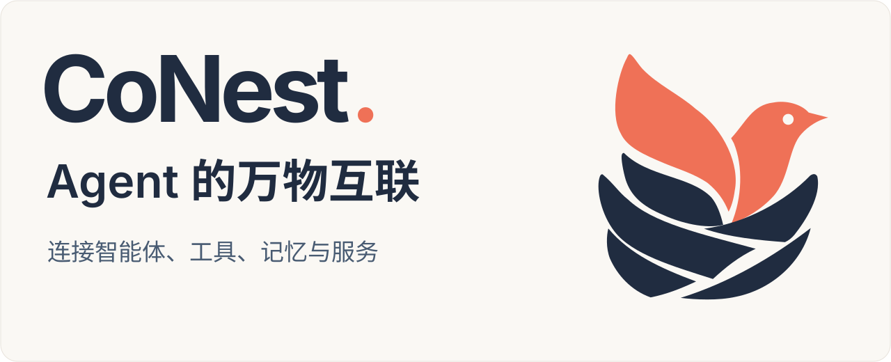

<div align="center">

<picture>
  <source media="(max-width: 600px) and (prefers-color-scheme: dark)" srcset="docs/assets/conest-banner-zh-mobile-dark.svg" />
  <source media="(max-width: 600px)" srcset="docs/assets/conest-banner-zh-mobile.svg" />
  <source media="(prefers-color-scheme: dark)" srcset="docs/assets/conest-banner-zh-dark.svg" />
  
</picture>

[English](README.md) &nbsp; / &nbsp; **简体中文**

[](https://github.com/zyw02/CoNest/actions/workflows/repository.yml) [](https://nodejs.org/) [](https://pnpm.io/) [](CONTRIBUTING.md)

<br />

<a href="#快速开始"><strong>快速开始</strong></a> &nbsp;·&nbsp; <a href="#快速开始"><strong>Studio</strong></a> &nbsp;·&nbsp; <a href="#分支与能力"><strong>能力地图</strong></a> &nbsp;·&nbsp; <a href="CONTRIBUTING.md"><strong>参与共建</strong></a> &nbsp;·&nbsp; <a href="https://github.com/zyw02/CoNest/issues"><strong>Issues</strong></a>

</div>

<br />

**CoNest 正在构建面向 Agent 的互联与协作基础设施。** 我们希望连接不同框架、不同运行环境中的 Agent，让工具、记忆、服务与工作流能够被发现、调用和组合，让各自独立的能力共同完成任务。

**当前实现：** OpenClaw 与 DeepSeek Harness（DSH）已通过统一的组件和运行时模型相连。Cordis 组件运行时负责组合工具、记忆与服务，CoNest Host 协调 Agent 会话和组件执行，Studio 统一呈现能力目录与执行记录。

CoNest 的目标是成为 Agent 运行时、可复用服务与 OS 执行节点之间的能力织网和任务控制平面。它服务于同一个长期任务跨越多种运行时、机器、权限边界与业务系统，同时保持统一身份、策略、操作记录和交付状态的场景。

CoNest 重点服务于：

- **跨运行时的企业交付** — 将内网数据、专业 Agent、本地应用、人工审批与业务系统提交组织成一个可恢复任务。
- **长时间运行的复杂操作** — 让编码、诊断、基础设施与人工决策在局部失败、取消、重试和转交中保持连续。
- **跨设备与边缘执行** — 将敏感操作放在合适的工作站、服务器或设备上，同时让云端 Agent 继续规划与协作。

CoNest 为不同 Agent SDK 定义统一的组件清单与运行协议。OpenClaw 和 DSH/Cordis 通过聚焦各自职责的适配层接入，[机器可读的兼容策略](compatibility.json)记录已验证版本。GitHub Actions 每日自动解析并测试 OpenClaw 与 DSH 的当前发行版，同时覆盖全部维护基线，让适配层持续跟随上游项目演进。

> [!TIP]
> **探索 0.6.4** — Gateway 与 CoNest Host 双进程、办公组件组合、共享记忆，以及通过 `--core` 启动的 OpenClaw + Core 专注体验。

## 让能力彼此相连

- **[连接 Agent](docs/README.md)** — 面向不同框架和运行环境扩展接入。当前以 OpenClaw 与 DSH 验证执行接入和工具互用。

- **[组合工具与服务](docs/README.md)** — 将能力组织成可复用组件，由运行时管理依赖、调用与生命周期，让服务彼此协作。

- **[让知识持续积累](#快速开始)** — 通过共享知识图谱捕获和召回记忆，让不同任务接续已记录的知识、约定与经验。

- **[观察能力如何运行](#快速开始)** — 在 Studio 查看工具与组件目录、执行结果和活动时间线。

<details>
<summary><strong>运行架构</strong> · Gateway / Host / 组件组合</summary>

0.6.4 采用 **Gateway 与 CoNest Host 两个常驻应用进程**。DSH Agent / Session 与 Management、Runtime 及所选组件组合共同运行在 Host 中。

标准启动组合 DSH 执行、共享记忆、受控文件读取和工作区搜索；`--core` 启动则组合 OpenClaw 连接与可复用的 Cordis 办公服务。两种方式都展示组件生命周期管理和每次调用所使用的一致依赖图。

</details>

<a name="快速开始"></a>

## 快速开始

**第一次使用，只需按本节操作。** 已验证的源码启动环境为 Linux x64、Node.js 24.16.0 和 pnpm 11.7.0；还需 Git、tar，以及原生编译所需的 Python 3、make 和 C++ 编译器。

```bash
git clone --branch develop https://github.com/zyw02/CoNest.git
cd CoNest
node scripts/maintenance/bootstrap.mjs
pnpm install --frozen-lockfile
pnpm build
CONEST_DEMO_STATE="$PWD/.local/studio" \
  pnpm start
```

打开终端输出的 Studio 地址，在连接设置中输入同次输出所指向的 `connection.json` 中的 Gateway token。默认端口为 18791，可用 `CONEST_DEMO_PORT` 覆盖；本地启动用 Ctrl+C 停止。被 Git 忽略的 `.local/studio/` 目录存放测试工作区、配置与记忆，不要指向客户工作区，也不要上传其中的文件。

默认使用本地模型 fixture，无需 API Key；Gateway、工具和记忆持久化实际执行。自动验证时在最后一条命令追加 `--verify`，检查结束后进程退出。真实模型需设置 `CONEST_CREDENTIAL_FILE` 指向包含 `DEEPSEEK_API_KEY` 且仅当前用户可读的凭据文件，并追加 `--live`；这会产生 API 费用。

如果启动失败，先核对 Node/pnpm 版本、端口与终端报错。SDK 下载问题见 [依赖维护说明（英文）](docs/dependencies.md)；已有 Gateway 的插件配置见 [宿主接入（英文）](docs/host-integration.md#plugin-configuration)。仍无法解决时，用 [Question 表单](https://github.com/zyw02/CoNest/issues/new?template=question.yml) 提供版本、命令和脱敏错误。

<a name="分支与能力"></a>

## 能力地图

| 层级 | CoNest 提供的能力 | 当前实现 |
| :--- | :--- | :--- |
| Agent 连接 | 在不同 Agent 运行时之间路由任务与能力调用 | OpenClaw Gateway 与 DSH Agent / Session 适配器 |
| 组件组合 | 发现服务并管理其依赖关系和生命周期 | Cordis 组件运行时与 CoNest 组件清单 |
| 工具互用 | 共享工作区、搜索、读取与办公能力 | `knowledge_search`、`dsh_grep`、`dsh_glob`、`dsh-read` 与办公组件 |
| 共享记忆 | 让已记录的知识与决策贯穿任务执行 | `dsh-memory`、知识图谱存储与 Gateway 持久化 |
| 任务执行 | 在托管环境中准入工具并运行动态组件 | CoNest Host、组件 worker 与会话编排 |
| 运行观测 | 查看可用能力、执行结果与活动过程 | CoNest Studio 能力目录与执行时间线 |

<a href="https://github.com/zyw02/CoNest/tree/main"><picture><source media="(prefers-color-scheme: dark)" srcset="docs/assets/readme/git-branch-dark.svg" /></picture> <code>main</code></a> 与 <a href="https://github.com/zyw02/CoNest/tree/develop"><picture><source media="(prefers-color-scheme: dark)" srcset="docs/assets/readme/git-branch-dark.svg" /></picture> <code>develop</code></a> 当前共享 0.6.4 实现。`main` 是稳定入口，`develop` 用于集成下一项经过评审的变更。

## 该看哪份文档？

- **运行项目：** 本页的 [快速开始](#快速开始)，或 [英文 README](README.md)。
- **报告问题、提交 PR：** [CONTRIBUTING](CONTRIBUTING.md)，统一的英文协作规范。
- **修改内部实现：** [开发参考索引](docs/README.md)，按组件、宿主接入或打包任务选择阅读。

[MIT 许可证](LICENSE) · [第三方许可声明](THIRD_PARTY_NOTICES.md) · [安全报告](SECURITY.md)

<br />

---

<div align="center">


**一起构建 Agent 的互联世界。**

从一个组件、一条反馈或一次 PR 开始。

[参与共建 →](CONTRIBUTING.md) &nbsp;·&nbsp; [反馈问题 →](https://github.com/zyw02/CoNest/issues)

<sub>Agents · Tools · Memory · Services &nbsp; / &nbsp; CoNest</sub>

</div>
