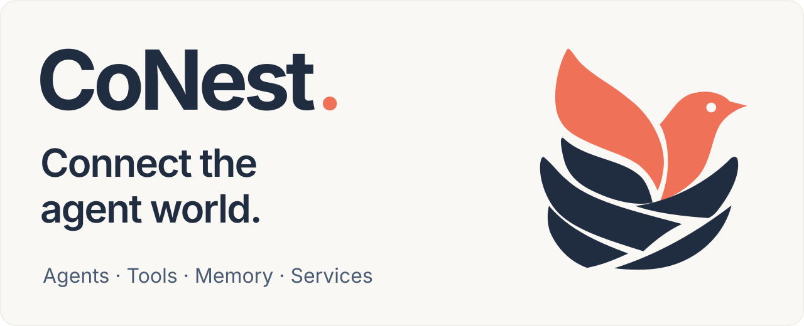

<div align="center">

<picture>
  <source media="(max-width: 600px) and (prefers-color-scheme: dark)" srcset="docs/assets/conest-banner-mobile-dark.svg" />
  <source media="(max-width: 600px)" srcset="docs/assets/conest-banner-mobile.svg" />
  <source media="(prefers-color-scheme: dark)" srcset="docs/assets/conest-banner-dark.svg" />
  
</picture>

**English** &nbsp; / &nbsp; [简体中文](README-zh.md)

[](https://github.com/zyw02/CoNest/actions/workflows/repository.yml) [](https://nodejs.org/) [](https://pnpm.io/) [](CONTRIBUTING.md)

<br />

<a href="#quick-start"><strong>Quick start</strong></a> &nbsp;·&nbsp; <a href="#quick-start"><strong>Studio</strong></a> &nbsp;·&nbsp; <a href="#branches"><strong>Capabilities</strong></a> &nbsp;·&nbsp; <a href="CONTRIBUTING.md"><strong>Contribute</strong></a> &nbsp;·&nbsp; <a href="https://github.com/zyw02/CoNest/issues"><strong>Issues</strong></a>

</div>

<br />

**CoNest is building an interconnected world for agents.** Our goal is to connect agents across frameworks and runtimes, so tools, memory, services and workflows can be discovered, invoked and composed into capabilities that work together.

**Available today:** OpenClaw and DeepSeek Harness (DSH) connect through a shared component and runtime model. A Cordis-based runtime composes tools, memory and services; CoNest Host coordinates Agent sessions and component execution; Studio presents the resulting capability catalog and execution history.

CoNest is intended to become the capability fabric and task control plane between Agent runtimes, reusable services and OS execution nodes. It serves durable work that crosses runtimes, machines, trust boundaries and business systems while retaining one identity, policy, operation history and deliverable state.

CoNest is being built for:

- **Cross-runtime enterprise delivery** — combine private data, specialist Agents, local applications, approval and business-system submission into one recoverable task.
- **Long-running operations** — coordinate coding, diagnosis, infrastructure and human decisions across partial failure, cancellation, retry and handoff.
- **Cross-device and edge execution** — place sensitive work on the right workstation, server or device while cloud Agents continue to plan and collaborate.

CoNest defines a common component manifest and runtime protocol across Agent SDKs. OpenClaw and DSH/Cordis connect through focused adapters, while the machine-readable [compatibility policy](compatibility.json) records qualified versions. A daily GitHub Actions watch resolves and tests the current OpenClaw and DSH releases alongside every maintained baseline, keeping the adapters current as upstream projects evolve.

> [!TIP]
> **Explore 0.6.4** — Gateway + CoNest Host, composable office services, shared memory, and a focused OpenClaw + Core experience via `--core`.

## Capabilities, connected

- **[Connect agents](docs/README.md)** — Extend access across frameworks and runtimes, starting with OpenClaw and DSH execution and tool interoperability.

- **[Compose tools & services](docs/README.md)** — Build reusable components. The runtime manages dependencies, invocation and lifecycle so services can work together.

- **[Let knowledge accumulate](#quick-start)** — Capture and recall a shared knowledge graph so tasks can build on recorded knowledge, decisions and experience.

- **[See how capabilities work](#quick-start)** — Browse tool and component catalogs, task results and the activity timeline in Studio.

<details>
<summary><strong>Runtime architecture</strong> · Gateway / Host / component compositions</summary>

Version 0.6.4 uses **two persistent application processes: Gateway and CoNest Host**. DSH Agent / Session runs inside Host alongside Management, Runtime and the selected component composition.

The standard launch composes DSH execution, shared memory, guarded file access and workspace search. The `--core` launch composes the OpenClaw connection with reusable Cordis office services. Both demonstrate lifecycle management and a consistent dependency graph for every call.

</details>

<a name="quick-start"></a>

## Quick start

**New here? This section is all you need to start.** The validated source environment is Linux x64, Node.js 24.16.0 and pnpm 11.7.0. Install Git, tar, Python 3, make and a C++ compiler for native dependencies.

```bash
git clone --branch develop https://github.com/zyw02/CoNest.git
cd CoNest
node scripts/maintenance/bootstrap.mjs
pnpm install --frozen-lockfile
pnpm build
CONEST_DEMO_STATE="$PWD/.local/studio" \
  pnpm start
```

Open the Studio URL printed in the terminal. Enter the Gateway token from the printed `connection.json` location in its connection settings. The default port is 18791; override it with `CONEST_DEMO_PORT`. Stop the local launcher with Ctrl+C. The ignored `.local/studio/` directory holds the fixture workspace, configuration and memory; do not point it at customer data or commit its contents.

The default model is a local fixture: no API key is needed, while Gateway, tools and persistence execute normally. Append `--verify` to the last command for an automated check that exits when finished. Live-model use requires an owner-readable file containing `DEEPSEEK_API_KEY`, selected by `CONEST_CREDENTIAL_FILE` and an explicit `--live` flag; it incurs API usage.

If startup fails, check Node/pnpm versions, port availability and the terminal error. See [dependency maintenance](docs/dependencies.md) for SDK download problems or [host configuration](docs/host-integration.md#plugin-configuration) for an existing Gateway. For further help, use the [Question form](https://github.com/zyw02/CoNest/issues/new?template=question.yml) with versions, commands and redacted errors.

<a name="branches"></a>

## Capability map

| Layer | What CoNest enables | Current implementation |
| :--- | :--- | :--- |
| Agent connectivity | Route tasks and capability calls across Agent runtimes | OpenClaw Gateway and DSH Agent / Session adapters |
| Component composition | Discover services and manage their dependencies and lifecycle | Cordis-based runtime and CoNest component manifests |
| Tool interoperability | Share workspace, search, reading and office capabilities | `knowledge_search`, `dsh_grep`, `dsh_glob`, `dsh-read` and office components |
| Shared memory | Carry recorded knowledge and decisions across task execution | `dsh-memory`, knowledge graph storage and Gateway persistence |
| Task execution | Admit tools and run dynamic components inside a managed host | CoNest Host, component worker and session orchestration |
| Observability | Inspect available capabilities, results and activity | CoNest Studio catalogs and execution timeline |

<a href="https://github.com/zyw02/CoNest/tree/main"><picture><source media="(prefers-color-scheme: dark)" srcset="docs/assets/readme/git-branch-dark.svg" /></picture> <code>main</code></a> and <a href="https://github.com/zyw02/CoNest/tree/develop"><picture><source media="(prefers-color-scheme: dark)" srcset="docs/assets/readme/git-branch-dark.svg" /></picture> <code>develop</code></a> currently share the 0.6.4 implementation. `main` is the stable entry point; `develop` is the integration branch for the next reviewed change.

## What should I read?

- **Run CoNest:** [Quick start](#quick-start) on this page, also available in [Chinese](README-zh.md).
- **Report a problem or submit a PR:** [CONTRIBUTING](CONTRIBUTING.md), the single collaboration policy.
- **Change implementation details:** [Developer reference index](docs/README.md), organized by components, host integration and packaging.

[MIT license](LICENSE) · [Third-party notices](THIRD_PARTY_NOTICES.md) · [Security](SECURITY.md)

<br />

---

<div align="center">


**Build an interconnected world for agents.**

Start with a component, an idea, or your first pull request.

[Contribute →](CONTRIBUTING.md) &nbsp;·&nbsp; [Report an issue →](https://github.com/zyw02/CoNest/issues)

<sub>Agents · Tools · Memory · Services &nbsp; / &nbsp; CoNest</sub>

</div>
